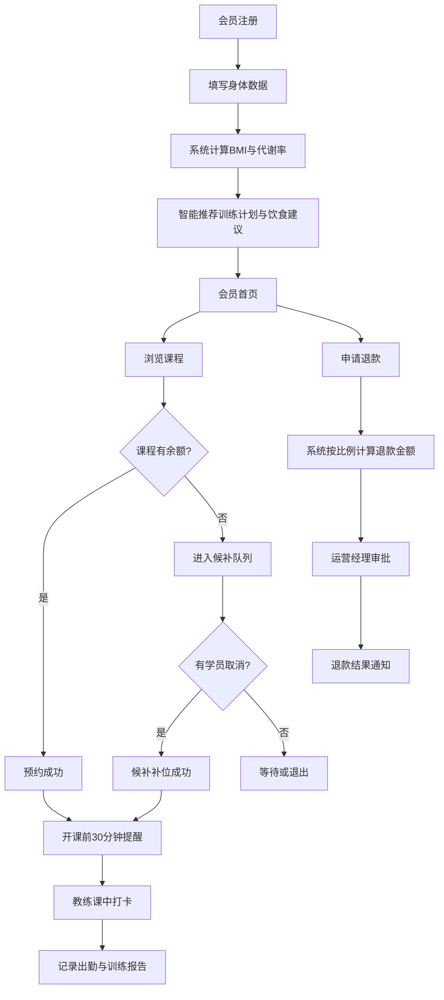

## 1. 产品概述

FitPro 连锁健身场馆会员管理与课程预约系统，为大型连锁健身品牌提供一站式数字化运营解决方案。系统覆盖会员、教练、运营经理、店长四种角色，实现从会员注册、智能推荐、课程预约、候补管理到运营数据分析的全流程闭环管理。

- 核心价值：通过智能推荐提升会员体验，通过自动化预约与候补机制优化场馆资源利用率，通过数据看板赋能管理层决策
- 目标用户：连锁健身场馆的会员群体、专业教练团队、运营管理人员及门店店长

## 2. 核心功能

### 2.1 用户角色

| 角色 | 注册方式 | 核心权限 |
|------|----------|----------|
| 会员 | 手机号+身体数据注册 | 查看推荐计划、预约/取消课程、候补队列、申请退款、查看消息、下载凭证 |
| 教练 | 管理员后台分配 | 创建课程（冲突检测）、课前提醒、课中打卡、上传训练报告、记录出勤、查看耗课率 |
| 运营经理 | 管理员后台分配 | 设置课程分类、配置收费规则、管理会员等级折扣、审批退款申请 |
| 店长 | 管理员后台分配 | 查看门店数据看板、预约率/流失率/满意度排名、导出月度运营报表 |

### 2.2 功能模块

1. **登录与角色选择页**：角色切换、身份验证、权限路由
2. **会员注册页**：身体数据采集（身高/体重/体脂率/训练目标/BMI自动计算）、智能推荐训练计划与饮食建议
3. **会员首页**：个人训练计划、饮食建议、课程预约入口、消息中心
4. **课程预约页**：课程列表、筛选、容量展示、预约/候补操作
5. **我的预约页**：已预约课程、候补状态、取消/退款申请、出勤记录
6. **教练工作台**：课程创建表单、课程日历、学员名单、打卡入口
7. **教练报告页**：训练报告上传、出勤记录、月均耗课率统计
8. **运营管理页**：课程分类管理、收费规则配置、会员等级折扣设置、退款审批
9. **店长看板页**：多门店数据概览、预约率/流失率/满意度图表、报表导出
10. **消息通知中心**：实时消息推送、操作详情查看、凭证下载

### 2.3 页面详情

| 页面名称 | 模块名称 | 功能描述 |
|----------|----------|----------|
| 登录页 | 角色选择卡片 | 四种角色图标卡片切换，账号密码登录，记住登录状态 |
| 会员注册页 | 身体数据表单 | 身高/体重/体脂率/年龄/性别/训练目标输入，实时BMI计算，提交后跳转推荐结果 |
| 会员注册页 | 智能推荐结果 | 基于身体数据生成初始训练计划（4周周期）、饮食建议（热量/宏量营养素/食谱示例） |
| 会员首页 | 个人数据概览 | 身体数据卡片、训练进度条、即将开始的课程、今日饮食建议 |
| 课程预约页 | 课程列表 | 按日期/分类/教练筛选，显示课程容量、已预约人数、价格、折扣后金额 |
| 课程预约页 | 候补队列 | 满员课程显示候补按钮，候补队列实时更新，有空位时自动补位 |
| 我的预约页 | 预约记录 | 已预约/已完成/已取消分类，候补状态，退款申请入口，出勤记录查看 |
| 我的预约页 | 退款申请 | 选择退款课程，系统按已上课次比例自动计算应退金额，提交审批 |
| 教练工作台 | 课程创建 | 选择日期/时段/课程分类/容量/价格，系统自动检测时段冲突，提交成功即创建 |
| 教练工作台 | 课程日历 | 按日历视图展示教练每日课程，开课前30分钟显示提醒标识 |
| 教练工作台 | 打卡与出勤 | 课中打卡按钮，学员名单勾选出勤，训练报告上传（文本+图片） |
| 教练报告页 | 耗课率统计 | 月度耗课率趋势图、同比环比、平均评分、学员满意度 |
| 运营管理页 | 课程分类 | CRUD课程分类，分类图标、描述、基础价格配置 |
| 运营管理页 | 收费规则 | 会员等级（普通/银卡/金卡/钻石）、对应折扣率、单次课/月卡/季卡/年卡价格 |
| 运营管理页 | 退款审批 | 待审批退款列表，显示已上课次比例、应退金额，一键通过/驳回 |
| 店长看板页 | 数据概览 | 各门店卡片展示预约率、会员流失率、教练满意度Top3排名 |
| 店长看板页 | 图表分析 | 月度预约率折线图、流失率柱状图、满意度雷达图、收入趋势图 |
| 店长看板页 | 报表导出 | 选择时间范围，导出Excel/PDF格式月度运营报表 |
| 消息中心 | 通知列表 | 预约成功/候补补位/退款审批/课程提醒等消息分类，未读红点提示 |
| 消息中心 | 消息详情与凭证 | 查看操作详情，下载PDF格式预约凭证/退款凭证/出勤凭证 |

## 3. 核心流程

### 3.1 会员注册与智能推荐流程
会员填写身体数据（身高、体重、体脂率、年龄、性别、训练目标）→ 系统自动计算BMI与基础代谢率 → 根据训练目标匹配训练计划模板（减脂/增肌/塑形/康复）→ 生成4周训练计划（每周训练频次、动作组合、强度递进）→ 计算每日热量需求与宏量营养素比例 → 推荐个性化饮食方案 → 展示完整推荐结果

### 3.2 课程预约与候补流程
会员浏览课程列表 → 选择课程查看详情 → 点击预约 → 检查课程容量 → 有空位则直接预约成功（推送预约消息+生成凭证）→ 已满员则自动进入候补队列（显示排队位置）→ 有学员取消时按候补顺序自动补位 → 推送补位成功消息 → 候补超时自动退出

### 3.3 教练授课流程
教练创建课程（选择时段/分类/容量）→ 系统检测该时段教练无冲突 → 创建成功 → 开课前30分钟系统自动推送提醒给所有预约学员 → 教练课中点击打卡 → 勾选学员出勤状态 → 课后上传训练报告（训练内容、学员表现、下次建议）→ 系统记录并更新教练耗课率

### 3.4 退款审批流程
会员在"我的预约"中申请退款 → 系统计算已上课次占总课次比例 → 自动计算应退金额 = 实付金额 × (1 - 已上课次比例) → 生成退款申请单推送给运营经理 → 运营经理审核通过/驳回 → 推送结果消息给会员 → 审批通过后可下载退款凭证

### 3.5 核心流程图

## 4. 用户界面设计

### 4.1 设计风格

- **主色调**：深邃黑 (#0F0F0F) + 活力橙 (#FF5E1A)，搭配中性灰 (#1E1E1E, #2A2A2A, #888888)
- **辅助色**：成功绿 (#00C48C)、警示红 (#FF4757)、信息蓝 (#3B82F6)
- **按钮风格**：圆角 12px，主按钮橙黑渐变，带微弱阴影与 hover 浮起效果
- **字体**：标题使用 Space Grotesk（粗重现代感），正文使用 Inter（高可读性）
- **布局风格**：深色主题侧边栏导航 + 卡片化内容区，大面积留白配合毛玻璃效果
- **图标风格**：线性图标搭配橙色点缀，动效用 CSS transition + transform

### 4.2 页面设计概览

| 页面名称 | 模块名称 | UI 元素 |
|----------|----------|---------|
| 登录页 | 角色选择卡片 | 4张等分布局卡片，悬停时橙色光晕上浮，选中态高亮边框 |
| 会员注册页 | 身体数据表单 | 分步表单（2步），大数字输入框，BMI实时计算动画条 |
| 会员注册页 | 智能推荐结果 | 双栏布局：左侧训练计划时间线，右侧饮食建议卡片网格 |
| 课程预约页 | 课程列表 | 瀑布式卡片，显示剩余容量进度条，折扣价高亮 |
| 课程预约页 | 候补队列 | 队列人数胶囊标签，候补位置徽章动画 |
| 教练工作台 | 课程日历 | 周视图日历，课程色块区分，悬浮卡片显示详情 |
| 教练报告页 | 耗课率统计 | 大数字KPI卡片 + 趋势折线图 + 环形进度图 |
| 店长看板页 | 数据概览 | 门店卡片横向滚动，核心指标大数字 + 环比箭头 |
| 店长看板页 | 图表分析 | 组合图表区，支持时间范围筛选与数据联动 |
| 消息中心 | 通知列表 | 时间线布局，未读橙色圆点，分类图标标签 |

### 4.3 响应式

- 桌面端优先设计（1440px基准），侧边栏固定宽度260px
- 平板端（1024px）侧边栏折叠为图标模式
- 移动端（768px）底部Tab导航，卡片单列布局
- 图表组件使用响应式SVG，触摸操作优化

### 4.4 交互动效

- 页面加载：元素从下至上渐入，延迟50ms错峰动画
- 卡片悬停：轻微上浮 + 橙色光晕扩散
- 按钮点击：缩放 0.97 + 涟漪效果
- 数据更新：数字滚动动画（countUp）
- 消息推送：右上角滑入通知条，3秒后自动收起
