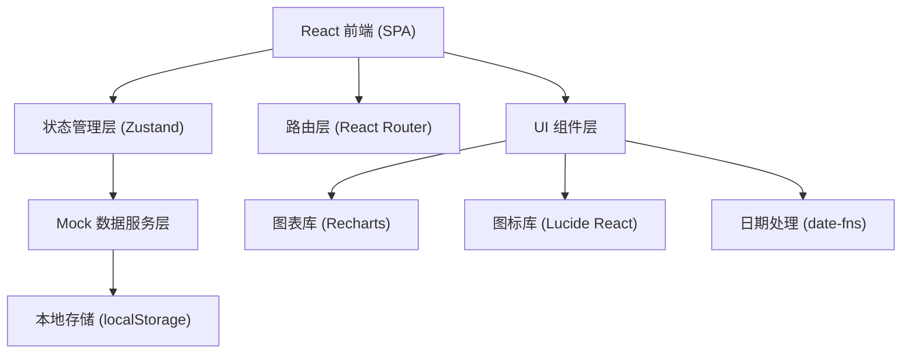
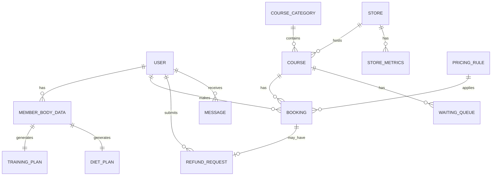

## 1. 架构设计



## 2. 技术选型

- **前端框架**：React 18 (TypeScript)
- **构建工具**：Vite 5
- **样式方案**：Tailwind CSS 3.4 + PostCSS
- **状态管理**：Zustand 4（轻量级、TypeScript友好）
- **路由方案**：React Router DOM 6
- **图表组件**：Recharts 2（React生态图表库）
- **图标库**：Lucide React（现代线性图标）
- **日期处理**：date-fns（轻量日期工具库）
- **后端方案**：无后端，纯前端 Mock 数据 + localStorage 持久化
- **数据存储**：localStorage 模拟数据库

## 3. 路由定义

| 路由路径 | 页面组件 | 权限角色 | 页面说明 |
|----------|----------|----------|----------|
| / | LoginPage | 公开 | 登录与角色选择页 |
| /register | RegisterPage | 公开 | 会员注册页（身体数据+智能推荐） |
| /member/home | MemberHomePage | member | 会员首页（训练计划+饮食建议） |
| /member/booking | MemberBookingPage | member | 课程预约页 |
| /member/my-bookings | MemberBookingsPage | member | 我的预约（含候补、退款申请） |
| /coach/dashboard | CoachDashboardPage | coach | 教练工作台（日历+课程管理） |
| /coach/reports | CoachReportsPage | coach | 教练报告与耗课率统计 |
| /manager/courses | ManagerCoursesPage | manager | 运营管理-课程分类与收费规则 |
| /manager/refunds | ManagerRefundsPage | manager | 运营管理-退款审批 |
| /owner/dashboard | OwnerDashboardPage | owner | 店长数据看板 |
| /messages | MessagesPage | 全部登录角色 | 消息通知中心 |

## 4. 类型定义

```typescript
// 用户角色
type UserRole = 'member' | 'coach' | 'manager' | 'owner';

// 会员等级
type MemberLevel = 'normal' | 'silver' | 'gold' | 'diamond';

// 训练目标
type TrainingGoal = 'lose_fat' | 'muscle_gain' | 'shaping' | 'rehabilitation';

// 课程状态
type CourseStatus = 'scheduled' | 'ongoing' | 'completed' | 'cancelled';

// 预约状态
type BookingStatus = 'booked' | 'waiting' | 'cancelled' | 'completed' | 'refunded';

// 退款状态
type RefundStatus = 'pending' | 'approved' | 'rejected';

// 消息类型
type MessageType = 'booking_success' | 'waiting_promoted' | 'course_reminder' | 
                   'refund_request' | 'refund_result' | 'attendance_record';

// 用户基础信息
interface User {
  id: string;
  role: UserRole;
  name: string;
  phone: string;
  avatar?: string;
  storeId?: string;
}

// 会员身体数据
interface MemberBodyData {
  memberId: string;
  height: number;      // cm
  weight: number;      // kg
  bodyFat: number;     // %
  age: number;
  gender: 'male' | 'female';
  goal: TrainingGoal;
  bmi: number;
  bmr: number;         // 基础代谢率 kcal
}

// 训练计划
interface TrainingPlan {
  id: string;
  memberId: string;
  weeks: TrainingWeek[];
  createdAt: string;
}

interface TrainingWeek {
  week: number;
  days: TrainingDay[];
}

interface TrainingDay {
  day: string;
  focus: string;
  exercises: TrainingExercise[];
}

interface TrainingExercise {
  name: string;
  sets: number;
  reps: string;
  rest: string;
}

// 饮食建议
interface DietPlan {
  id: string;
  memberId: string;
  dailyCalories: number;
  protein: number;     // g
  carbs: number;       // g
  fat: number;         // g
  meals: DietMeal[];
}

interface DietMeal {
  type: 'breakfast' | 'lunch' | 'dinner' | 'snack';
  name: string;
  calories: number;
  items: string[];
}

// 课程分类
interface CourseCategory {
  id: string;
  name: string;
  icon: string;
  description: string;
  basePrice: number;
  color: string;
}

// 课程
interface Course {
  id: string;
  categoryId: string;
  coachId: string;
  storeId: string;
  title: string;
  date: string;        // YYYY-MM-DD
  startTime: string;   // HH:mm
  endTime: string;     // HH:mm
  capacity: number;
  bookedCount: number;
  price: number;
  status: CourseStatus;
  description?: string;
}

// 候补队列
interface WaitingQueue {
  courseId: string;
  members: { memberId: string; joinedAt: string }[];
}

// 预约记录
interface Booking {
  id: string;
  memberId: string;
  courseId: string;
  status: BookingStatus;
  price: number;
  discountRate: number;
  actualPrice: number;
  bookedAt: string;
  attendance?: boolean;
  trainingReport?: string;
}

// 退款申请
interface RefundRequest {
  id: string;
  bookingId: string;
  memberId: string;
  totalSessions: number;
  completedSessions: number;
  refundRatio: number;
  paidAmount: number;
  refundAmount: number;
  status: RefundStatus;
  reason: string;
  createdAt: string;
  reviewedAt?: string;
  reviewerId?: string;
}

// 收费规则
interface PricingRule {
  level: MemberLevel;
  levelName: string;
  discountRate: number;   // 0-1
  singlePrice: number;
  monthlyPrice: number;
  quarterlyPrice: number;
  yearlyPrice: number;
}

// 门店
interface Store {
  id: string;
  name: string;
  address: string;
  city: string;
}

// 教练统计
interface CoachStats {
  coachId: string;
  month: string;
  totalCourses: number;
  consumedCourses: number;
  consumptionRate: number;
  avgSatisfaction: number;
}

// 门店运营数据
interface StoreMetrics {
  storeId: string;
  month: string;
  bookingRate: number;        // 预约率 %
  churnRate: number;          // 会员流失率 %
  avgSatisfaction: number;    // 平均满意度
  totalRevenue: number;
  activeMembers: number;
}

// 消息通知
interface Message {
  id: string;
  userId: string;
  role: UserRole;
  type: MessageType;
  title: string;
  content: string;
  relatedId?: string;
  relatedType?: 'booking' | 'course' | 'refund';
  read: boolean;
  createdAt: string;
  hasVoucher: boolean;
}
```

## 5. 状态管理结构

```
Store (Zustand)
├── authStore
│   ├── currentUser: User | null
│   ├── isAuthenticated: boolean
│   ├── login(role, phone, password)
│   ├── register(bodyData)
│   └── logout()
│
├── memberStore
│   ├── bodyData: MemberBodyData | null
│   ├── trainingPlan: TrainingPlan | null
│   ├── dietPlan: DietPlan | null
│   ├── bookings: Booking[]
│   ├── waitingQueues: WaitingQueue[]
│   ├── generatePlan(bodyData)
│   ├── bookCourse(courseId)
│   ├── cancelBooking(bookingId)
│   ├── joinWaiting(courseId)
│   └── applyRefund(bookingId, reason)
│
├── coachStore
│   ├── courses: Course[]
│   ├── stats: CoachStats | null
│   ├── createCourse(data)
│   ├── checkConflict(coachId, date, startTime, endTime)
│   ├── checkIn(courseId, attendances)
│   └── uploadReport(bookingId, report)
│
├── managerStore
│   ├── categories: CourseCategory[]
│   ├── pricingRules: PricingRule[]
│   ├── refundRequests: RefundRequest[]
│   ├── upsertCategory(data)
│   ├── deleteCategory(id)
│   ├── updatePricingRules(rules)
│   └── reviewRefund(requestId, approve)
│
├── ownerStore
│   ├── stores: Store[]
│   ├── metrics: StoreMetrics[]
│   ├── coachRankings: CoachStats[]
│   ├── fetchMetrics(month)
│   └── exportReport(month, format)
│
└── messageStore
    ├── messages: Message[]
    ├── unreadCount: number
    ├── sendMessage(userId, type, content)
    ├── markRead(messageId)
    └── markAllRead()
```

## 6. 数据模型（Mock 初始数据）

### 6.1 ER 关系图



### 6.2 初始数据种子

```typescript
// 门店数据
const initialStores: Store[] = [
  { id: 's1', name: 'FitPro 旗舰店', address: '南京路88号', city: '上海' },
  { id: 's2', name: 'FitPro 朝阳店', address: '朝阳路168号', city: '北京' },
  { id: 's3', name: 'FitPro 天河店', address: '天河路200号', city: '广州' },
  { id: 's4', name: 'FitPro 南山店', address: '科技园路50号', city: '深圳' },
];

// 课程分类
const initialCategories: CourseCategory[] = [
  { id: 'c1', name: '动感单车', icon: 'bike', description: '高强度有氧燃脂', basePrice: 88, color: '#FF5E1A' },
  { id: 'c2', name: '瑜伽', icon: 'flower2', description: '身心放松塑形', basePrice: 128, color: '#00C48C' },
  { id: 'c3', name: '力量训练', icon: 'dumbbell', description: '肌群强化训练', basePrice: 158, color: '#3B82F6' },
  { id: 'c4', name: 'HIIT', icon: 'flame', description: '高强度间歇训练', basePrice: 98, color: '#FF4757' },
  { id: 'c5', name: '普拉提', icon: 'activity', description: '核心控制力训练', basePrice: 148, color: '#A855F7' },
];

// 收费规则
const initialPricingRules: PricingRule[] = [
  { level: 'normal', levelName: '普通会员', discountRate: 1, singlePrice: 0, monthlyPrice: 399, quarterlyPrice: 999, yearlyPrice: 3599 },
  { level: 'silver', levelName: '银卡会员', discountRate: 0.9, singlePrice: 0, monthlyPrice: 599, quarterlyPrice: 1499, yearlyPrice: 5399 },
  { level: 'gold', levelName: '金卡会员', discountRate: 0.8, singlePrice: 0, monthlyPrice: 899, quarterlyPrice: 2299, yearlyPrice: 8199 },
  { level: 'diamond', levelName: '钻石会员', discountRate: 0.65, singlePrice: 0, monthlyPrice: 1499, quarterlyPrice: 3899, yearlyPrice: 13999 },
];
```

## 7. 目录结构

```
src/
├── assets/              # 静态资源
│   └── fonts/
├── components/          # 通用组件
│   ├── layout/         # Layout, Sidebar, Header
│   ├── ui/             # Button, Card, Modal, Badge, Toast
│   └── charts/         # 各图表组件
├── pages/              # 页面组件
│   ├── Login.tsx
│   ├── Register.tsx
│   ├── member/
│   │   ├── Home.tsx
│   │   ├── Booking.tsx
│   │   └── MyBookings.tsx
│   ├── coach/
│   │   ├── Dashboard.tsx
│   │   └── Reports.tsx
│   ├── manager/
│   │   ├── Courses.tsx
│   │   └── Refunds.tsx
│   ├── owner/
│   │   └── Dashboard.tsx
│   └── Messages.tsx
├── store/              # Zustand stores
│   ├── authStore.ts
│   ├── memberStore.ts
│   ├── coachStore.ts
│   ├── managerStore.ts
│   ├── ownerStore.ts
│   └── messageStore.ts
├── types/              # TypeScript 类型
│   └── index.ts
├── utils/              # 工具函数
│   ├── bmi.ts          # BMI/代谢率计算
│   ├── plan.ts         # 训练/饮食推荐算法
│   ├── price.ts        # 价格/退款计算
│   ├── voucher.ts      # 凭证生成（模拟PDF）
│   └── mockData.ts     # 初始Mock数据
├── hooks/              # 自定义 hooks
│   ├── useAuth.ts
│   └── useMessages.ts
├── App.tsx
├── main.tsx
└── index.css
```
